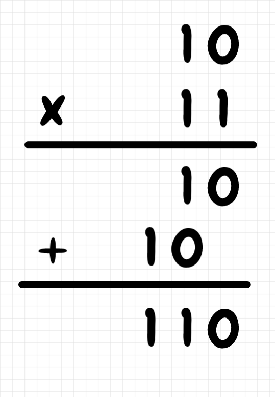
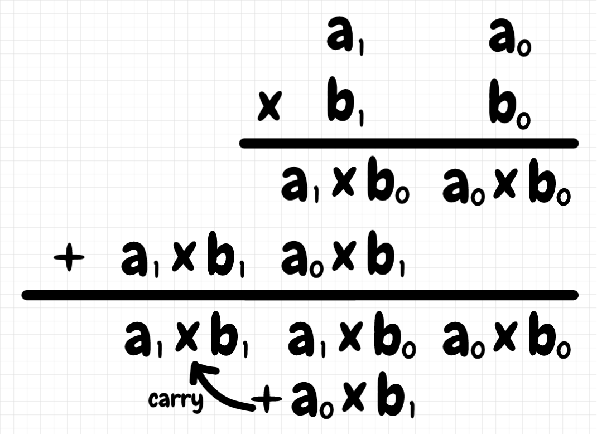

# Multiplication

As promised, we have a bonus section for you about binary multiplication. Just like binary addition, let's start with a single bit.

| a | b | a \* b |
| :---: | :---: | :---: |
| 0 | 0 | 0 \* 0 = 0 |
| 0 | 1 | 0 \* 1 = 0 |
| 1 | 0 | 1 \* 0 = 0 |
| 1 | 1 | 1 \* 1 = 1 |

Binary multiplication works the same way as decimal multiplication. If one of the numbers is `0`, the product is `0`. Only if both numbers are `1` is the product `1`. Hopefully, you noticed the truth table right away. It's just the same as the truth table of the `and` gate. So 1-bit multiplication is really just 1-bit `and`.

## 2-bit Multiplication

Let's first look at a sample 2-bit multiplication with `10 x 11`:



This works exactly the same as decimal multiplication. Now, instead of using concrete numbers, let's generalize this process using variable for each digit. So we will be multiplying two 2-bit numbers `a` and `b`. Since they are both 2 bits, we can express the digits of `a` as `a1 a0` and the digits of `b` as `b1 b0`. The process is exactly the same as the previous number example:



Now it's your turn to implement the 2-bit multiplier in Sim.

Here's the header:

```text
mul2 a[2] b[2] -> [4]
```

Notice that the output size is `4` because the result of multiplying two 2-bit numbers can fill up `4` digits:

```text
    11
x   11
――――――
    11
+  11
――――――
  1001
```



If you get stuck, click on "See Hints".



Do you recall a circuit we built for adding two 1-bit number? Also try breaking the problem down into three stages.



