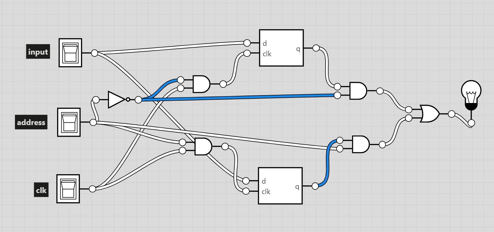

# Random Access Memory

It's time to gather our knowledge of digital memory and create the ultimate storage unit: Random Access Memory or RAM for short. You might heard of things like "my computer ran out of RAM" or "xxx app drained my RAM real quick". These illustrate how important RAM is to the function of our computer. The reason why we rely on RAM so much is because it's blazing fast and the location of the memory doesn't not influence access speed, hence the name "random access memory". An additional magic is that no matter how much stuff our RAM stores, the access time is constant. So a RAM with 10 gigabytes is just as fast as one with 10 megabyte even though the first one stores 1000 times more stuff than the second. Before we move on to explore RAM more, you should watch Computerphile's clear explainations of RAM first:





## RAM2

After watching the two videos, let's start by creating RAM with 2 flip flops:



It's your turn to implement the above in Sim. Here's the header:

```text
ram2 clk input[n] address[1] -> [n]
```



If you get stuck, click on "See Hints".



Fill in the blanks below:

```text
ram2 clk input[n] address[1] -> [n] =
    let
        clk_a =
            ___________________
        clk_b =
            ___________________
        out_a =
            ___________________
        out_b =
            ___________________
        out =
            ___________________
    in
    out
```



If you completed the `ram2`, you may start to realize that we already built parts of it before. The way we connect the `address` to the `clk` signals of the two flip flops is just a regular `dmux`. The way we connect the two `q`s of the two flip flops to the final output is just a regular `mux`. Now with the same header, try implement `ram2` again using `dmux` and `mux`.

```text
ram2 clk input[n] address[1] -> [n]
```



If you get stuck, click on "See Hints".



Fill in the blanks below:

```text
ram2 clk input[n] address[1] -> [n] =
    let
        { a = clk_a, b = clk_b } =
            ___________________
        out_a =
            ___________________
        out_b =
            ___________________
        out =
            ___________________
    in
    out
```



## RAM8

Now that you know how to address 2 flip flops in a RAM, we can easily expand it into 8 flip flops:

```text
ram8 clk input[n] address[3] -> [n]
```



If you get stuck, click on "See Hints".



Fill in the blanks below:

```text
ram8 clk input[n] address[3] -> [n] =
    let
        { a = clk_a, b = clk_b, c = clk_c, d = clk_d
        , e = clk_e, f = clk_f, g = clk_g, h = clk_h
        } =
            ___________________

        out_a =
            ___________________
        
        out_b =
            ___________________
        
        out_c =
            ___________________

        out_d =
            ___________________

        out_e =
            ___________________
        
        out_f =
            ___________________
        
        out_g =
            ___________________

        out_h =
            ___________________

        out =
            ___________________
    in
    out
```



## RAM64

Combine 8 RAM8 to form RAM64.

```text
ram64 clk input[n] address[6] -> [n]
```

## RAM512

Combine 8 RAM64 to form RAM512.

```text
ram512 clk input[n] address[9] -> [n]
```

## RAM4K

Combine 8 RAM512 to form RAM4K.

```text
ram4k clk input[n] address[12] -> [n]
```

## RAM16K

Combine 4 RAM4K to form RAM16K. Not 8 this time, but 4.

```text
ram16k clk input[n] address[14] -> [n]
```

🎉 Congrats! You have created the memory unit of our computer!

